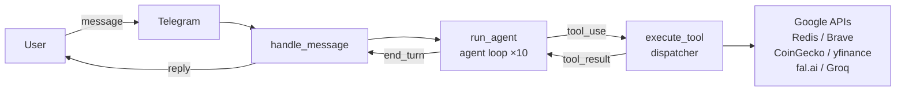

# Personal AI Assistant for Telegram

> Production AI assistant with 25+ integrated tools, long-term memory, and voice input. Built with Claude API and Python.

[](https://python.org) [](https://anthropic.com) [](https://railway.app)

## What it does

Personal AI assistant living in Telegram. Handles natural-language requests across 25+ integrations: Gmail, Google Calendar, Google Tasks, Google Drive, Brave Search, weather, crypto prices, stock quotes, fal.ai image generation, Groq Whisper voice-to-text. Maintains long-term memory across sessions — facts are stored in Redis and injected into every system prompt.

- "What's on my calendar this week?" → Google Calendar
- "Read my emails from Amazon" → Gmail
- "Remind me to call the dentist at 3pm" → Reminder (Redis)
- "What's the price of BTC?" → CoinGecko / Binance
- "Generate an image of a futuristic city" → fal.ai FLUX
- *sends a voice message* → transcribed via Groq Whisper → answered by Claude

## Architecture

Single-file Python bot ([bot.py](bot.py), 3500 lines) built around a stateful agent loop. Each incoming message starts a `run_agent()` call that drives Claude through up to 10 tool-use iterations until it reaches `end_turn`. `execute_tool()` dispatches tool calls to 25+ handler functions covering Google Workspace APIs, financial data, web search, and file handling. Conversation history (last 60 messages, 7-day TTL) and long-term user memory are persisted in Redis. python-telegram-bot v21 handles all Telegram events asynchronously.



## Tech stack

**Core:** Python 3.12, Claude API (`claude-sonnet-4-6`, agent loop with tool use), Redis  
**Voice:** Groq Whisper Large V3  
**Integrations:** Gmail API, Google Calendar API, Google Tasks API, Google Drive API, Brave Search, CoinGecko, Binance, yfinance, fal.ai FLUX  
**Infrastructure:** Railway (auto-deploy on git push)

## Key features

- **Multi-tool agent loop** — Claude calls tools iteratively until it has enough context to reply (up to 10 iterations)
- **Persistent long-term memory** — user facts retained across sessions, injected into every system prompt
- **Voice input** — voice messages transcribed via Groq Whisper Large V3, passed to Claude as text
- **Financial data** — crypto prices (CoinGecko + Binance fallback), stocks/indices/metals (yfinance), DexScreener token lookup by contract address
- **Morning digest** — daily briefing at 11:00: weather + calendar events + tasks
- **Competitive radar** — weekly AI agent market digest from Brave Search + HackerNews (every Monday)
- **Price alerts** — background job polls every 5 min, notifies when trigger price is hit
- **File handling** — read PDF/Word from chat, upload to Drive, attach to Gmail

## Code highlights

- [bot.py:2441](bot.py#L2441) — `run_agent()`: agent loop, up to 10 Claude API iterations
- [bot.py:1059](bot.py#L1059) — `execute_tool()`: tool dispatcher, 25+ handlers
- [bot.py:481](bot.py#L481) — `TOOLS`: tool schema definitions for Claude function calling
- [bot.py:50](bot.py#L50) — Redis memory layer: history, reminders, price alerts, long-term facts

## Local setup

```bash
git clone https://github.com/borisk85/tg-bot
cd tg-bot
python -m venv .venv
source .venv/bin/activate  # on Windows: .venv\Scripts\activate
pip install -r requirements.txt
cp .env.example .env
# Fill in your API keys in .env
python bot.py
```

### Google OAuth2 setup

```bash
python auth_google.py   # opens browser, saves refresh token to console
```

Copy the printed `GOOGLE_REFRESH_TOKEN` to your `.env`.

> Keep your Google Cloud Console app in **Published** mode — Testing mode expires refresh tokens every 7 days.

### Deploy to Railway

1. Fork this repo
2. Create a Railway project, connect your GitHub repo
3. Add all environment variables in Railway dashboard
4. Push to `master` — Railway deploys automatically

## Environment variables

| Variable | Required | Description |
|---|---|---|
| `TELEGRAM_TOKEN` | yes | From @BotFather |
| `ANTHROPIC_API_KEY` | yes | Anthropic API key |
| `REDIS_URL` | yes | Redis connection URL |
| `GOOGLE_CLIENT_ID` | yes | Google OAuth2 client ID |
| `GOOGLE_CLIENT_SECRET` | yes | Google OAuth2 client secret |
| `GOOGLE_REFRESH_TOKEN` | yes | Obtained via `auth_google.py` |
| `BRAVE_API_KEY` | yes | Brave Search API |
| `OPENWEATHER_API_KEY` | yes | OpenWeatherMap API |
| `FAL_API_KEY` | yes | fal.ai image generation |
| `GROQ_API_KEY` | yes | Groq voice transcription |
| `ELEVENLABS_API_KEY` | no | ElevenLabs TTS |
| `REDDIT_CLIENT_ID` | no | Reddit API (weekly digest) |
| `REDDIT_CLIENT_SECRET` | no | Reddit API (weekly digest) |
| `FIRECRAWL_API_KEY` | no | Firecrawl web scraping |

## About

Built and maintained by Boris Komarov as a personal productivity tool. Part of a portfolio of production AI products: [Velabot](https://velabot.io).

## Contact

- Studio: [vibecraft.kz](https://vibecraft.kz)
- Email: bkomarov85@gmail.com
- Telegram: [@borisk85](https://t.me/borisk85)

---

*Closed contributions. This is a personal project showcased as portfolio.*
